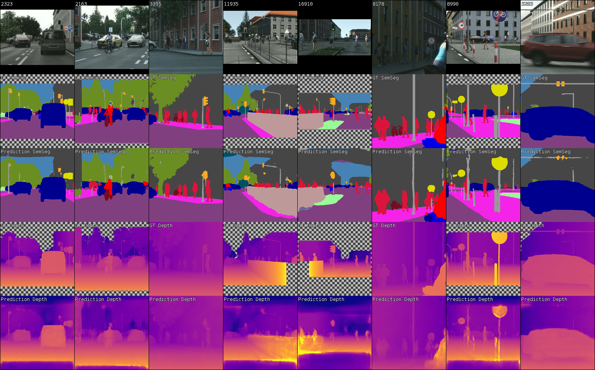

# TO run
-ASPP 2 conv3x3 puis interpolate (sans conv1x1) 

-ASPP 1 conv3x3 + conv1x1 puis interpolate (en fonction des performances des 2conv3x3)

-branched model avec la meilleure architecture ASPP

-Task3 avec la meilleure architecture ASPP

# TO SUBMIT TO CODALAB

-> **Runs in batch size 4 and num epoch 16:**

- **_In DLAD-EX-2_**
1. Q1a)
- Best SGD: lr = 0.075, WandB: G5_0408-0855_sgd_0.075_32012
- Best Adam: lr = 0.0001, WandB: G5_0406-1928_adam_0.0001_5bdd2

2. Q1b)
- Batch size 8, num epoch 32: WandB: G5_0409-0814_adam_0.0001_8_32_ca036
- _Performs better at epoch 32, but is grader is lower at epoch 16 compared to batch size 4_
- Batch size 16, num epoch 64: WandB: G5_0410-0930_adam_is_0.0001_16_64_c5452

3. Available is batch size 8 and epochs 32
- 0.7 depth, semseg 0.3 (best): WandB: G5_0411-0757_adam_0.0001_8_32_0.7depth_a6901
- 0.3 depth, semseg 0.7 (worst): WandB: G5_0409-0818_adam_0.0001_8_32_0.3depth_c1b69
- **redo with batch size 4 and num epoch 16** 
- 0.35 depth, semseg 0.65: WandB: G5_0501-2035_4_16_0.35_depth_3a5e1
- 0.65 depth, semseg 0.35: WandB: G5_0501-2027_4_16_0.65_depth_e02c5

4. Init with Imagenet (pretrained)
- only have this one in 8-16 for now: G5_0408-1628_adam_lr0_is_0.0001_8_16_pretrained_
- **redo it in 4-16 to compare**

5. Dilated convolutions  (False, False, True)
- only have 16 -64 for now G5_0411-0807_adam_0.0001_16_64_pretrained_dilation
- redo training with 4-16, pretrained, dilation only in task weighting 0.5 0.5 ?
- we have: **_In DLAD-EX2-4-16_**
- G5_0423-0955_4_16_pretrained_dil_0.4_depth_4e3b8
- G5_0423-0946_4_16_pretrained_dil_0.6_depth_2c034
- performing nearly the same
- If we choose 25 (maybe a bit less to speed up training) for the next models, we also need to train our best model before ASPP in 4-25 for fair comparison

6. ASPP and Skip Connection
- **_In DLAD-EX2-4-16_**
- Batch size 4 and num epoch 25: G5_0428-1049_aspp_4_25_2_3x3_1x1_08a84

7. Branched model

8. Distillation Model

# DLAD Exercise 2 

Multitask Semantic Segmentation and Monocular Depth prediction for Autonomous Driving


 
This is a template project for the practical assignment #2 in Deep Learning for Autonomous Driving course:
https://www.trace.ethz.ch/teaching/DLAD

Please refer to the assignment PDF for instructions regarding the assignment scope. 

### AWS Setup

If not already done, please follow [doc/AWS_SETUP.md](doc/AWS_SETUP.md) to setup your AWS access.

### AWS Training

You can simply launch a training on an AWS EC2 instance using:

```shell script
python aws_start_instance.py
```

During the first run, the script will ask you for some information such as the wandb token for the setup.
You can attach to the launched tmux session by running the last printed command. If you want to close the connection
but keep the script running, detach from tmux using Ctrl+B and D. After that, you can exit the ssh connection, while
tmux and the training keep running. You can enter the scroll mode using Ctrl+B and [ and exit it with Q. 
In the scroll mode, you can scroll using the arrow keys or page up and down. Tmux has also some other nice features
such as multiple windows or panels (https://www.hamvocke.com/blog/a-quick-and-easy-guide-to-tmux/). Please note
that there is a **timeout** of 24 hours to the instance. If you find that not sufficient, please adjust 
`TIMEOUT = 24  # in hours`
in [aws_start_instance.py](aws_start_instance.py). To check if you are unintentionally using AWS resources, you can
have a look at the AWS cost explorer: https://console.aws.amazon.com/cost-management/home?region=us-east-1#/dashboard.

In order to change the training arguments or run multiple trainings after each other, you can have a look at 
[aws_train.sh](aws_train.sh). This bash script setups your environment and executes the python training script 
[mtl/scripts/train.py](mtl/scripts/train.py). Here is also the place, where you want to specify your hyperparameters
as command line arguments. The default call looks like this:

```shell script
python -m mtl.scripts.train \
  --log_dir /home/ubuntu/results/ \
  --dataset_root /home/ubuntu/miniscapes/ \
  --name Default \
  --optimizer sgd \
  --optimizer_lr 0.01
```

The full description of all command line keys can be found in [config.py](mtl/utils/config.py).

### AWS Interactive Development

During developing your own code, you'll often run into the problem that the training crashes briefly after the start due
to some typo. In order to avoid the overhead of waiting until AWS allows you to start a new instance as well as the
instance setup, you can continue using the same instance for further development. For that purpose cancel the automatic
termination using Ctrl+C. Fix the bug in your local environment and update your AWS files by running the rsync command, 
which was printed by aws_start_instance.py, on your local machine. After that, you can start the training on the AWS 
instance by running:
```shell script
cd ~/code/ && bash aws_train.sh
``` 

For development, feel free to use your additional m5.large instance (10x cheaper than p2.xlarge) by setting

```python
INSTANCE_TYPE = 'm5.large'
```

in [aws_start_instance.py](aws_start_instance.py). It is sufficient to check if a training crashes in the beginning.
However, do NOT use it for regular training because it will be much slower and in total even more expensive than p2.xlarge.
Also, do not keep it running longer than necessary. 
If you want to test changes of the training framework, please have a look at the commented options of the Trainer in 
[mtl/script/train.py](mtl/script/train.py). 

### Weights and Biases Monitoring

You can monitor the training via the wandb web interface https://wandb.ai/home. If you have lost the ec2 instance 
information for a particular (still running) experiment, you can view it by choosing the 
Table panel on the left side and horizontally scroll the columns until you find the EC2 columns. 
You can even use the web interface to stop a run (click on the three dots beside the run name and choose Stop Run). 
After you stopped the run, it'll still do the test predictions and terminate its instance afterwards. If you do not 
stop a run manually, it will terminate it's instance as well after completion.

In the workspace panel, we recommend switching the x-axis to epoch (x icon in the top right corner) for
visualization.
The logged histograms, you can only view if you click on a single run.

### AWS S3 Checkpoints and Submission Zip

To avoid exceeding the free wandb quota, the checkpoints and submission zips are saved to AWS S3. The link is logged
to wandb. You can find it on the dash board (https://wandb.ai/home) in the Table panel (available on the left side)
in the column S3_Link. 

Use the following command to download a submission archive to the local machine:

```shell script
aws s3 cp <s3_link> <local_destination>
```

### Resume Training

If a spot instance was preempted, you can resume a training by providing the resume flag to mtl.scripts.train in 
[aws_train.sh](aws_train.sh). 

```shell script
python -m mtl.scripts.train \
  --log_dir /home/ubuntu/results/ \
  --dataset_root /home/ubuntu/miniscapes/ \
  --name Default \
  --optimizer sgd \
  --optimizer_lr 0.01 \
  --resume s3://BUCKET_NAME/RUN_NAME/
```

To find out the checkpoint path, go to the wandb Table panel (available on the left side) and checkout the column 
S3_Path. Please note that you will continue from the best performing checkpoint, which is not necessarily the last one. 
This can result in an overlap of both runs. Due to randomness, the runs can achieve different performances in the
overlapping range. Also, you should choose "epoch" as x-axis to avoid visualization issues. 

 
